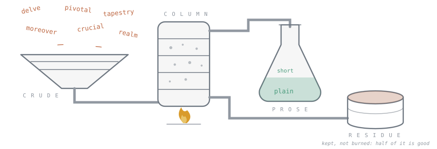
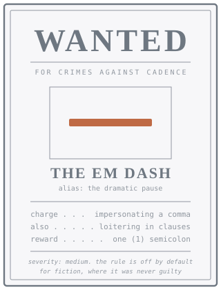
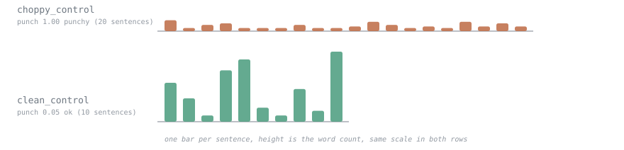

# sloprefine



This is a slop refinery. Crude prose goes in, and something with fewer of the
documented markers of machine-generated writing comes out. The residue is
reported rather than discarded, because about half of it turns out to be
perfectly good writing.

It is not a detector and will not tell you who wrote something. Pointed at
labelled data it ranked New Yorker short stories as more machine-like than
GPT-4. I did not expect that, and I do not know how much of it is the corpus
being fiction rather than the rules being wrong. Either way it marks the
boundary the tool works inside: what these rules measure is register, which a
genre owns as much as an author does.

```bash
sloprefine prompt --profile talk > .style-contract   # constrain generation
sloprefine check draft.md --profile talk             # what to change
sloprefine drift draft.md draft.v2.md                # did that edit help
```

Step three is the one people skip. Across the revision rounds of the talk this
repository was built for, two thirds of them introduced a new hit while fixing
an old one, and one of them reintroduced the exact cadence the whole project
exists to remove, with a paragraph of metrics arguing that it was an
improvement.

## Most of it is not a banned-words list

The rule table is the smallest part of this. Half those rules failed to
discriminate on the one labelled corpus they have been tried against, and
each carries what the audit found. The measurement layers are the rest of the
package.

One rule is shaped differently from the rest. `vague` asks a long paragraph
to name something checkable, and it is the only entry in the table that
cutting words cannot satisfy. The rules section covers what counts.

The cadence layer measures what a listener hears rather than what a reader
scans. `punch` folds choppiness, paragraph closers, balanced pairs and
parallel runs into a single number, which scores the clean corpus control at
0.05 and the choppy one at 1.00. That number is the thing this project
started over.

Generation can be shaped before the fact instead of repaired after it.
`sloprefine prompt --profile talk` emits the constraints as a contract to put
in front of a model, carrying that profile's actual numbers: a five-word
sentence floor, 12% choppiness, and 10% of paragraphs allowed to end on a
punch.

Whether an edit helped is a separate question from whether it removed hits,
and `sloprefine drift before.md after.md` answers the first one. It reports
what a revision cost alongside what it fixed, because two thirds of the
rounds measured here broke something while mending something else.

A baseline can be yours rather than a population's. `sloprefine voice build
~/writing -o me.json` learns one from your own prose, after which stylometry
is reported as deviation from you. Fewer than three documents of 150 words
and it refuses, on the grounds that a baseline drawn from two describes those
two.

Whether any of this holds on your material is checkable. `sloprefine audit
--ai theirs/ --human mine/` measures which rules actually separate the two
piles, and prints the ones that do not. That command is what put an audited
number beside every rule in the table.

Readers are not interchangeable either. Passing `--audience expert` changes
the contract, because the two clusters in [MGF25] weight different features.
Experts reward variety of device and penalise a uniform positive tone, and
the human writing they preferred scored lower on local coherence than the
machine writing did.

## Claims this package made, and the measurements that overturned them

Each entry is a claim that was written down as true, the measurement that contradicted it, and the version where that happened.

**v0.5.** Three separate metrics agreed that a revision had improved the
prose. All three were measuring the same artifact, because chopping text into
fragments raises lexical density and burstiness by construction. One artifact
counted three times looks exactly like three confirmations.

**v0.8.** The parallelism budget spent its allowance on the widest runs, which
gave the worst offender in every document a guaranteed free pass and flagged
the milder ones underneath it. A test asserted this behaviour and passed.

**v1.1.** Smith-Waterman local alignment was the obviously correct algorithm
for matching parallel structure through noisy edges. Measured, it scored
ordinary prose higher than the constructions it was built to catch. The module
is still in the tree with the numbers in its docstring so nobody spends a
week on it again.

**v1.2.1.** The syntactic-template measure was described as generalising every
shape rule in the package. Breaking seven of the eight doublets in a real
document moved the number by 0.0017, in the wrong direction.

**v1.3.** The first audit against labelled data found that ten of twenty rules
did not discriminate, and eight fired more often on human writing. The em dash
was 2.6 times more common in the human corpus. The fragment stack, which is
the thing that started this project, was 2.7 times more common.

**v1.4.1.** The headline metric was calibrated against a "human prose control"
written by hand for this repository. Against real human writing it inverted.

**v1.4.3.** The profile that pins the cadence rules was applied to a config
object that the next line rebuilt from scratch, silently discarding it. For
four rounds the tool reported PASS on a draft containing the sentence the
doublet rule was written for. A human caught it by reading.

**v1.5.1.** Three consecutive version bumps failed silently, so the built
wheel carried a version four releases behind the code.

**v1.6.2.** The doublet path segmented on punctuation alone, so a balanced
pair joined by "and" rather than by a comma was never formed and never
tested. "one of them practical and one of them a warning" scored zero.
Coordination splitting had been in the parallelism path since v0.7 and was
never shared with doublets. Sharing one segmenter then exposed a pair that
had sat in the clean control from the beginning, under a test asserting the
control had none. My first repair of that sentence chopped it into three
short ones, which removed the pair and raised syntactic template reuse from
1.58 to 3.43, near the slop control's 3.57. That is the trade documented two
entries above, walked into while fixing the thing above it.

Every one was found by measuring something already written down as true, and
each has a test holding it. I expect the list to keep growing, because the
claims that go unmeasured are the ones stated most confidently.

## This file is linted by the thing it documents

CI fails if this README scores above zero, which rules out most of the ways a
README is usually funny.

<!-- sloprefine: off (the next paragraph commits every violation it names,
     which is the point, and it is the only hand-written exemption in the
     repository that is not a table of rule names) -->

No fragments for emphasis. No rule of three. No "it's not a linter, it's a
refinery."

<!-- sloprefine: on -->

Writing the marketing copy under the marketing copy's own constraints is a
useful exercise and not a pleasant one.

The linter has caught five genuine tricolons in these docs, one antithesis in
the sentence explaining why antitheses are bad, and a paragraph making a
confident claim with nothing specific in it, which was the paragraph about
how confident claims need specifics.

## Install

```bash
pip install sloprefine
sloprefine draft.md
```

This needs Python 3.11 or newer and has no runtime dependencies. Three
optional extras exist and nothing in the core path needs any of them: `mcp`
for the server, `lm` for the perplexity layer, which pulls in `transformers`
and `torch`, and `dev` for the test suite. To work on the package itself,
clone it and run `pip install -e ".[dev,mcp]"` instead.

## The three layers

### Rules

<p align="center"></p>

<!-- sloprefine: off (this table quotes the patterns it documents) -->

| rule | catches | source |
|---|---|---|
| `vocab` | delve, underscore, showcase, pivotal, crucial, intricate, realm, tapestry | Kobak et al. 2025; Juzek & Ward 2025 |
| `emdash` | the "ChatGPT dash" | Augmented Educator; palvdm |
| `negation` | "not just X, but Y", "it isn't A, it's B" | palvdm; Cherryleaf |
| `parallel` | a repeated syntactic skeleton at any arity, over a budget | Cherryleaf; palvdm; Kao |
| `doublet` | balance starting at two: "a study, or a written argument" | Cherryleaf; palvdm |
| `fragments` | three or more very short sentences in a row | Forbes |
| `transitions` | Moreover, Furthermore, It is important to note | Wikipedia; Kao |
| `narrator` | "Here's the thing", "That's the paradox", "Let me be clear" | palvdm; Forbes |
| `participial` | ", highlighting the need for..." | Kao; Kobak |
| `fromto` | "From bustling cities to serene coastlines" | Augmented Educator |
| `opener` | three consecutive sentences opening on the same word | Kao; Kumarage et al. |
| `template` | the same four-word frame reused three times | Kumarage et al. |
| `colon` | setup colon, then the payoff | palvdm |
| `question` | sections opening with a rhetorical question | palvdm |
| `recap` | "In short", "The takeaway is" | palvdm |
| `hedge` | "That said", "At the end of the day" | Wikipedia |
| `emoji` | rockets in prose | Wikipedia |
| `runt` | a verbless sentence under the floor: "One plot." | Forbes; local |
| `closer` | a punch landing in the same slot paragraph after paragraph | Forbes; palvdm |
| `vague` | a 40-word paragraph naming no number, year, unit or proper noun | Kao; local |
| `person` | "you" standing in for "one" or "we" | local |

<!-- sloprefine: on -->

**`vague` is the only requirement in the table.** Every other rule is a
prohibition, and a prohibition can always be satisfied by writing less. A
requirement cannot be, so a paragraph over 40 words that names no number,
year, unit, proper noun or quoted term fails however it is phrased. What it
lacks is a fact rather than a habit. "Several studies" fails and "Kobak
2025" passes. Shorter paragraphs owe nothing, on the grounds that they are
usually doing connective work.

The abuse is obvious and `vague` cannot detect it. A model told to name a
figure in each paragraph will duly produce one, and a wrong figure is worse
than a vague phrase because it is checkable and false. Pair it with a
fact-checking step, which this package does not provide.

`sloprefine rules` prints all of them with citations and rationale.

### Stylometry



Eight model-free features, computed per document with no language model, no
API, and no corpus statistics. The core set comes from Shan, Lee and Hao
(arXiv:2608.27855), who tested 14 such features over 45,000 texts across 8
LLMs and 5 domains.

Their central finding inverts the folk theory. AI-generated text has **higher**
lexical diversity and **higher** entropy than human writing, not lower, and
those two features are the only ones that stay important across every
generator and domain they tried.

Their second finding matters more for anyone actually using this tool. AI
*editing* does not reproduce that footprint. Text a human wrote and an LLM
polished shows only a slight diversity rise, an entropy *drop*, and one large
effect on lexical density, which falls by d = -3.10 as the proportion of
content words to function words collapses. Their classifiers separate AI-edited from
AI-generated text at AUC 0.98, but manage only 0.80 separating AI-edited from
human. Editing is not a weak form of generation. It is a different thing with
a different signature, and editing is what most people are doing.

Two implementation departures from the paper, both deliberate:

- **Length correction.** Type-token ratio and entropy both fall with document
  length for arithmetic reasons, which is why the authors had to stratify
  their corpora by length. Rather than stratify, `sloprefine` uses a
  moving-average TTR over a fixed window and normalizes entropy by log2 of
  the type count. A regression test asserts that plain TTR collapses on a
  quadrupled document while the corrected measure holds. Our numbers are
  therefore not their numbers.
- **No thresholds.** The paper reports everything z-scored against its own
  corpora. A cutoff lifted from one corpus and applied to another is exactly
  the failure documented by Liang et al. in *Patterns*, where detectors
  systematically misread non-native English writing as machine output because
  simpler word choice reads as low perplexity. So the stylometry layer ships
  no population cutoffs at all. Without a voiceprint it prints values and says
  nothing about them.

### Reader signals: what people actually want, measured after 2022

Removing markers is only half a writing tool. The other half cannot come from
a rhetoric textbook, because of a contamination problem.

Any device widely *prescribed* before 2022 sits in the advice corpus,
therefore in the training data, therefore in the model's default register. The
rule of three is the clearest case: genuinely effective, taught for a century,
and now so overproduced that it appears on detection-marker lists. Prescription
made it a target and optimization made it a tell. Parallelism, alliteration,
readability-formula optimization and "vary your sentence length" are all on the
same path.

So a positive signal gets in here only if its direction was measured after
2022 against real reader judgments. The source is Marco, Gonzalo and Fresno
(arXiv:2506.03310), who modeled 101 annotators over 1,471 stories with 17
reference-less features and per-reader preference models.

Their first finding is that there is no single target. Reader preferences
cluster into two profiles. Lay readers weight readability, sentence length,
syntactic depth and lexical diversity, and they frequently prefer machine
text. Experts weight sentiment dynamics and sentence rhythm, along with
rhetorical variety and thematic entropy, and they do not. A tool that emits one universal
definition of good writing is asserting something the data denies, so
`--audience expert|general` is required to turn this layer on.

Their Table 3 gives per-corpus means for human and machine text, and four
directions replicate across both expert-annotated corpora:

<!-- sloprefine: off -->

| feature | human | machine | implemented as |
|---|---|---|---|
| mean sentiment | -0.12, +0.05 | +0.74, +0.78 | lexicon proxy, abstains under 15 valence tokens |
| sentiment variance | 0.91, 0.91 | 0.43, 0.36 | same proxy, chunked |
| sentence rhythm | 11.0, 24.5 | 10.3, 16.9 | stdev of sentence length |
| local coherence | 0.31, 0.32 | 0.41, 0.48 | content-word overlap between adjacent sentences |

<!-- sloprefine: on -->

The sentiment pair is the largest and the least comfortable: machine text is
relentlessly positive and flat, and expert-preferred human text varies about
twice as much. Sentence rhythm and local coherence say the same thing
structurally. Machine prose is smoother between adjacent sentences than the
prose experts prefer, which means the usual advice to improve flow is pointed
in the wrong direction for that audience.

Three of their features need models this package will not require. Local
coherence wants sentence embeddings. Thematic entropy wants LDA, and
rhetorical variety wants a large model. Each is approximated with a lexical proxy and each
proxy is labeled as one in the output. The sentiment proxy abstains rather
than reporting a number when too few valence tokens match, which is the normal
case for technical prose.

This layer also resolves the rule-of-three problem rather than banning it.
Expert readers weighted rhetorical *variety*. The tool therefore measures
`device_variety` alongside `device_concentration`, and complains when one
device carries most of the work. Three items is fine. Reaching for three items in every paragraph is
what gives the game away.

### The audit: markers decay, so measure the decay

```bash
sloprefine audit --ai out/gpt-drafts --human ~/writing/mine
```

Everything above is dated, and the `vocab` list shows why. Kobak et al.
measured "delves" at 28x excess frequency in 2024 abstracts. Avoiding that
word is now standard advice, which moves writers off it as fast as it moves
models. A tool built on a fixed list decays silently.

`audit` makes the decay measurable. Point it at a corpus of machine text and a
corpus of human text and it reports, per rule, how much more often the pattern
appears in the machine half:

```
rules (enrichment = machine rate / human rate)
  vocab         ai 112.06  human   0.00  x  inf  machine-only
  transitions   ai  22.84  human   0.00  x  inf  machine-only
  emdash        ai   0.00  human   0.00  x 1.00  unobserved

features (Cohen's d, machine vs human)
  topic_spread           ai    0.000  human    0.833  d= -3.16 (machine lower)
  mean_sentence_len      ai    8.117  human   20.833  d= -2.38 (machine lower)
```

Enrichment far above 1 means the marker still works. Around 1 means it is dead
and carries no information, whether because models stopped or writers started.
Below 1 means it has inverted, which is what a widely adopted fix looks like
from the other side. Feature effects use Cohen's d so they are directly
comparable to the numbers in the papers.

`corpus/audit-demo/` ships a runnable pair, and its README says plainly that
both sides were written by hand and none of its numbers are evidence. Replace
it with output from the models you actually use and your own writing from
before you used them.

### Voiceprints

```bash
sloprefine voice build ~/writing/published -o me.json
sloprefine prompt --voice me.json          # targets, before generation
sloprefine check draft.md --voice me.json  # deviations, after
```

A voiceprint is the robust center and spread (median and MAD) of each feature
across documents you wrote. A draft is scored in sigma units against your own
distribution, so the claim becomes "your lexical density is 2.4 sigma below
your own baseline", which is a statement about a change in your writing.
Without it the claim would be "your lexical density is 0.49", which is a
statement about you, and that is the kind of statement that gets people
accused of things.

Requires at least 3 documents of 150+ words. It refuses below that, because a
baseline from two paragraphs describes those two paragraphs.

This layer has the strongest evidence of anything here. Chakrabarty, Ginsburg
and Dhillon (arXiv:2510.13939) collected 10,920 pairwise judgments comparing
MFA-trained writers against frontier models. With in-context prompting, MFA
readers disfavored the machine on quality at OR=0.13 while general readers
favored it at OR=1.82. Fine-tuning on a single author's complete works
reversed it: MFA stylistic fidelity went to OR=8.16.

Matching one specific author beats generic quality, by a wide margin, for the
readers who are hardest to please. That is an argument for building the target
out of your own corpus rather than out of anyone's rules, including these.

### Optional: perplexity structure

```bash
pip install "sloprefine[lm]"
sloprefine draft.md --lm gpt2
```

Reports perplexity and, more usefully, how much perplexity varies across
windows of the document. Uniform predictability end to end is the flat-rhythm
finding one layer down. This is a number, never a verdict. The state of the
art is Binoculars (Hans et al., ICML 2024), whose perplexity to
cross-perplexity ratio reaches over 90% TPR at 0.01% FPR; its own authors ship
a fixed threshold and still caution against unsupervised use. Use their
implementation if you want detection. This is a writing tool.

## MCP server

```bash
uv tool install "sloprefine[mcp]"    # a binary that outlives any project venv
claude mcp add --scope user sloprefine -- "$(which sloprefine-mcp)"
```

For a host configured by file rather than by CLI, give the absolute path:

```json
{"mcpServers": {"sloprefine": {"command": "/Users/you/.local/bin/sloprefine-mcp"}}}
```

Use the absolute path rather than the bare name. A desktop host starts its
servers from an environment it did not inherit from your shell, so
`~/.local/bin` is usually missing from the PATH handed down, and the server
dies with "command not found" before it can say anything more useful.

Four tools: `check` returns PASS or the grouped fixes, `drift` compares two
revisions and says whether the edit helped, `contract` returns the constraints
to follow before writing, and `metrics` returns the numbers for tracking a
draft over time.

Three choices worth knowing. Text is the primary input rather than a path,
because a model revising its own output has the draft in context and no file
on disk. `check` returns the compact agent format, roughly a fifth the tokens
of the JSON, since a tool that returns 8 kB of metrics spends the caller's
context on numbers it will not act on. And the round budget travels with the
result, because the failure mode of a linter in a loop is a model revising
until the count reaches zero.

`sloprefine-mcp --transport streamable-http` serves a remote client instead.
A stdio server is a subprocess on the same machine, so no amount of config
makes one visible to a client running anywhere else. The HTTP bind is
`127.0.0.1` unless you pass `--host`, because `0.0.0.0` stands up an
unauthenticated endpoint that accepts other people's prose and that is worth
typing out rather than inheriting. Put authentication in front of it before it
leaves your machine.

The server ignores any `.sloprefine.toml` in its working directory. An agent
host launches it from an arbitrary cwd, and picking up a config from there
would make the same text score differently for invisible reasons. Pass
`config_path` to use one.

## Configuration

`.sloprefine.toml`, searched upward from the working directory:

```toml
[sloprefine]
disable = ["colon", "hedge"]
allow = ["landscape", "robust"]   # domain words exempt from the lexicon
voice = "me.json"
max_hits = 0
```

The allowlist carries more weight than it looks. `landscape` is on the
excess-vocabulary list and is also a normal word in half a dozen fields, and
`robust` is how statisticians say robust. A linter that cannot be told this
gets uninstalled within a week, and then it protects nobody.
`--allow-domain-words` exempts the usual suspects in one flag.

Fenced code blocks in Markdown are exempt by default, and anything between
`<!-- sloprefine: off -->` and `<!-- sloprefine: on -->` is skipped, so
documentation that quotes the patterns does not fail its own lint. CI asserts
that this README scores zero.

## Wiring it into an agent

Exit codes are the interface: `check` returns 1 over threshold, `drift`
returns 1 on `churned`, `overfit` or `traded` by default.

```bash
#!/usr/bin/env bash
# revise.sh: loop with a stop condition that is not "zero hits"
cp draft.md work.md
for round in 1 2 3; do
  sloprefine check work.md --format agent > feedback.txt || true
  grep -q '^PASS$' feedback.txt && break
  your-model --instructions feedback.txt --input work.md --output next.md
  if ! sloprefine drift work.md next.md; then
    echo "round $round did not improve the draft; keeping the previous version"
    break
  fi
  mv next.md work.md
done
```

Three rounds is the hard ceiling in `agent.MAX_ROUNDS`, and the reason is the
trade above: past a couple of passes the model is writing for the linter.

As a library:

```python
import sloprefine

review = sloprefine.review("draft.md", text)
if not review.passed:
    feedback = review.render()          # grouped, imperative, compact
    revised = my_model(text, feedback)
    d = sloprefine.drift(text, revised)
    text = revised if d.improved else text
```

For a persistent agent config, put the contract where the model reads it:

```bash
sloprefine prompt --voice me.json >> AGENTS.md
```

## A worked example, and the trade it exposed

The tool started as a script for cleaning the machine cadence out of a
conference talk. On the rule layer it worked, taking that talk from 24 hits
down to 1.

Then the stylometry layer went in and got pointed at both versions. Lexical
density had gone from 0.530 to 0.493 and entropy had ticked down. That is the
direction Shan et al. measure for AI editing, produced by the exact pass that
removed the AI cadence.

Both things are true. The rewrite reads less like a machine and measures
slightly more like machine-edited text, because dissolving fragment stacks
into flowing sentences adds function words, which is what lexical density
counts. If you use this tool to clean a draft, expect that trade and watch the
density number.

## What this will not do

It will not tell you the writing is good. A draft scoring zero can be
lifeless, and a draft firing eight times can be the better piece. Several of
these patterns are effective rhetoric used deliberately and sparingly, and
fragment triads in particular work from a podium where a listener has no
rewind button. The tool counts. You decide.

It will not survive its own popularity. These are surface patterns, and
surface patterns move once enough people know them. The vocabulary list is
already aging. Treat the rules as a cited snapshot, not a law.

Do not use it to accuse anyone of anything. Not students, not applicants, not
colleagues. Liang et al. is the reason, and the harm falls hardest on the
writers who can least afford it.

## Contributing

New rules need a citation. See `CONTRIBUTING.md`.

## References

- Kobak, González-Márquez, Horvát and Lause, *Science Advances* 2025. Delving into LLM-assisted writing in biomedical publications through excess vocabulary.
- Juzek and Ward, COLING 2025. Why Does ChatGPT "Delve" So Much?
- Shan, Lee and Hao, arXiv:2608.27855 (2026). AI Writers Have a Consistent Stylometric Footprint, but AI Editors Do Not.
- Liang, Yuksekgonul, Mao, Wu and Zou, *Patterns* 2023. GPT detectors are biased against non-native English writers.
- Hans et al., ICML 2024. Spotting LLMs With Binoculars.
- Bao et al., ICLR 2024. Fast-DetectGPT.
- Mitchell et al., ICML 2023. DetectGPT.
- Verma, Fleisig, Tomlin and Klein, NAACL 2024. Ghostbuster.
- Kumarage et al., arXiv:2303.03697. Stylometric Detection of AI-Generated Text in Twitter Timelines.

## License

MIT.
